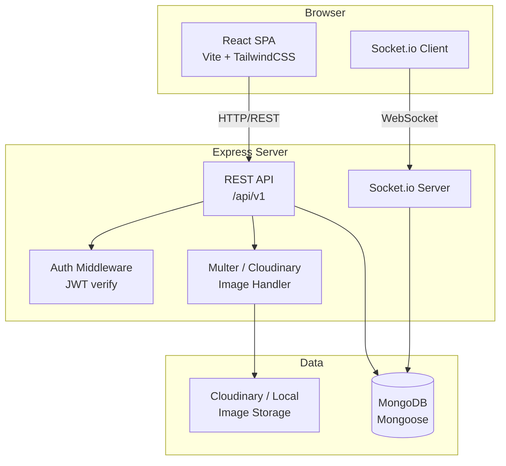

# Design Document: Literary and Debating Society Blog Platform

## Overview

The Literary and Debating Society is a full-stack blog platform with a dark academia aesthetic. It enables authenticated users to create, edit, and delete rich blog posts with cover images and inline images. The homepage organizes posts by category with real-time filtering. A cinematic intro animation plays on first session load. Socket.io broadcasts real-time notifications to all connected clients when a new post is published. A single admin account can moderate any post.

**Tech Stack:**
- Frontend: React + Vite + TailwindCSS (with custom dark academia theme tokens)
- Backend: Node.js + Express REST API
- Database: MongoDB with Mongoose ODM
- Real-time: Socket.io (server + client)
- Image uploads: Multer (local disk or Cloudinary)
- Auth: JWT (access tokens stored in `localStorage` or `httpOnly` cookie)
- Rich text editor: TipTap (ProseMirror-based, supports image embeds)

---

## Architecture

The system follows a classic client-server architecture with a WebSocket layer for real-time events.



### Request Flow

1. Client sends JWT in `Authorization: Bearer <token>` header.
2. Auth middleware validates the token and attaches `req.user` to the request.
3. Route handlers call service functions that interact with Mongoose models.
4. On successful post creation, the Post Service emits a `new_post` Socket.io event.
5. All connected Socket.io clients receive the event and display a toast notification.

---

## Components and Interfaces

### Backend Components

#### Auth Service (`/api/v1/auth`)

| Method | Path | Description |
|--------|------|-------------|
| POST | `/register` | Create a new user account |
| POST | `/login` | Authenticate and receive JWT |

#### Post Service (`/api/v1/posts`)

| Method | Path | Auth | Description |
|--------|------|------|-------------|
| GET | `/` | Public | List all posts |
| GET | `/:id` | Public | Get single post |
| POST | `/` | User | Create post |
| PUT | `/:id` | User/Admin | Edit post |
| DELETE | `/:id` | User/Admin | Delete post |

#### Image Service (`/api/v1/images`)

| Method | Path | Auth | Description |
|--------|------|------|-------------|
| POST | `/upload` | User | Upload image, return URL |

#### Socket.io Events

| Event | Direction | Payload |
|-------|-----------|---------|
| `new_post` | Server → All clients | `{ title, author, category, postId }` |

### Frontend Components

```
src/
  components/
    IntroAnimation.jsx       # Full-screen zoom-in text animation
    Navbar.jsx               # Navigation with auth state
    PostCard.jsx             # Card shown in Feed
    PostEditor.jsx           # TipTap rich text editor wrapper
    CategoryFilter.jsx       # Filter bar on homepage
    NotificationToast.jsx    # Socket.io toast display
    AdminControls.jsx        # Edit/Delete buttons (admin-only)
  pages/
    HomePage.jsx             # Feed with category grouping + filter
    PostDetailPage.jsx       # Full post view
    CreatePostPage.jsx       # Post creation form
    EditPostPage.jsx         # Post edit form
    LoginPage.jsx            # Login form
    RegisterPage.jsx         # Registration form
    AdminPage.jsx            # Admin panel listing all posts
  context/
    AuthContext.jsx          # JWT state, login/logout helpers
    SocketContext.jsx        # Socket.io connection + event listeners
  hooks/
    usePosts.js              # Fetch/mutate posts
    useNotifications.js      # Subscribe to new_post events
```

---

## Data Models

### User

```js
{
  _id: ObjectId,
  username: { type: String, required: true, unique: true },
  email:    { type: String, required: true, unique: true },
  password: { type: String, required: true },   // bcrypt hash
  role:     { type: String, enum: ['user', 'admin'], default: 'user' },
  createdAt: Date
}
```

### Post

```js
{
  _id:        ObjectId,
  title:      { type: String, required: true },
  author:     { type: String, required: true },   // display name, not User ref
  category:   { type: String, required: true, enum: ['Literature','Debate','Philosophy','Poetry','Essays'] },
  coverImage: { type: String },                   // URL
  body:       { type: String, required: true },   // TipTap HTML/JSON
  editor:     { type: ObjectId, ref: 'User', required: true },
  createdAt:  { type: Date, default: Date.now }
}
```

### JWT Payload

```js
{
  sub:  "<userId>",
  role: "user" | "admin",
  iat:  <issued-at>,
  exp:  <expiry>
}
```

---

## Correctness Properties

*A property is a characteristic or behavior that should hold true across all valid executions of a system — essentially, a formal statement about what the system should do. Properties serve as the bridge between human-readable specifications and machine-verifiable correctness guarantees.*

### Property 1: Registration round-trip

*For any* valid unique username, email, and password, registering a new account and then logging in with those credentials should return a valid JWT containing the correct user identity.

**Validates: Requirements 2.1, 2.3**

---

### Property 2: Duplicate email rejected

*For any* email address already associated with an existing account, a second registration attempt using that email should be rejected with an error and no new account should be created.

**Validates: Requirements 2.2**

---

### Property 3: Invalid credentials rejected

*For any* login attempt with a password that does not match the stored hash for the given email, the Auth Service should return an error and must not issue a JWT.

**Validates: Requirements 2.5**

---

### Property 4: Passwords are never stored in plaintext

*For any* registered user, the value stored in the `password` field of the User document must not equal the plaintext password provided at registration.

**Validates: Requirements 2.6**

---

### Property 5: Post creation round-trip

*For any* valid post payload (title, author, category, body) submitted by an authenticated user, creating the post and then fetching it by ID should return a document whose fields match the submitted values exactly.

**Validates: Requirements 3.1, 3.5**

---

### Property 6: Required post fields enforced

*For any* post creation request missing one or more of the required fields (title, author name, category, body), the Post Service should reject the request and no post should be persisted.

**Validates: Requirements 3.2, 4.2**

---

### Property 7: Image upload URL association

*For any* image file uploaded via the Image Service, the returned URL should be non-empty and, when associated with a post (as cover image or inline image), should be retrievable from the stored post document.

**Validates: Requirements 3.3, 3.4**

---

### Property 8: Notification emitted on post creation

*For any* successfully created and persisted post, the Notification Service should emit exactly one `new_post` Socket.io event whose payload contains the post's title, author name, and category.

**Validates: Requirements 3.6, 9.1, 9.2**

---

### Property 9: Category filter correctness

*For any* set of posts and any selected category filter, every post returned by the filter function should belong to the selected category, and no post belonging to the selected category should be omitted.

**Validates: Requirements 8.2**

---

### Property 10: "All" filter returns complete set

*For any* set of posts, applying the "All" filter should return every post in the collection — the filter is an identity operation on the full post list.

**Validates: Requirements 8.3**

---

### Property 11: Feed grouping invariant

*For any* set of posts, the feed grouping function should produce groups such that every post within a group shares the same category value, and every post in the input appears in exactly one group.

**Validates: Requirements 7.1**

---

### Property 12: Post card contains required fields

*For any* post, the rendered post card should include the post's title, author name, category, and cover image URL.

**Validates: Requirements 7.2**

---

### Property 13: Owner-only edit enforcement

*For any* post and any authenticated user who is not the post's editor and does not have the admin role, an edit request should be rejected with a 403 Forbidden response and the post should remain unchanged.

**Validates: Requirements 5.1, 5.2**

---

### Property 14: Owner edit round-trip

*For any* post and its owner, submitting valid edits should result in the post document being updated so that fetching the post returns the new field values.

**Validates: Requirements 5.3**

---

### Property 15: Owner-only delete enforcement

*For any* post and any authenticated user who is not the post's editor and does not have the admin role, a delete request should be rejected with a 403 Forbidden response and the post should remain in the database.

**Validates: Requirements 6.1, 6.2**

---

### Property 16: Delete removes post from feed

*For any* post owned by a user, after the owner deletes it, fetching the full post list should not contain that post.

**Validates: Requirements 6.3**

---

### Property 17: Admin bypasses ownership checks

*For any* post created by any user, an authenticated admin should be able to both edit and delete that post without receiving a 403 error, regardless of who created it.

**Validates: Requirements 10.2, 10.3**

---

### Property 18: Non-admin blocked from admin actions

*For any* non-admin authenticated user attempting to invoke admin-only moderation actions on posts they do not own, the Post Service should return a 403 Forbidden response.

**Validates: Requirements 10.4**

---

## Error Handling

### HTTP Error Codes

| Scenario | Status Code | Response Body |
|----------|-------------|---------------|
| Missing required post fields | 400 Bad Request | `{ error: "Validation failed", fields: [...] }` |
| Invalid or expired JWT | 401 Unauthorized | `{ error: "Authentication required" }` |
| Non-owner edit/delete attempt | 403 Forbidden | `{ error: "Forbidden" }` |
| Post not found | 404 Not Found | `{ error: "Post not found" }` |
| Duplicate email on register | 409 Conflict | `{ error: "Email already in use" }` |
| Image upload failure | 500 Internal Server Error | `{ error: "Image upload failed" }` |

### Frontend Error Handling

- API errors are caught in `usePosts` and `AuthContext` hooks and surfaced as user-facing messages.
- Image upload failures show an inline error near the upload control without blocking the rest of the form.
- Socket.io disconnections are handled silently — the client attempts reconnection automatically; no notification is shown for missed events (per Requirement 9.4).
- Form validation runs client-side before submission to give immediate feedback, but server-side validation is the authoritative check.

### Auth Middleware

```js
// Pseudocode
function authMiddleware(req, res, next) {
  const token = req.headers.authorization?.split(' ')[1];
  if (!token) return res.status(401).json({ error: 'Authentication required' });
  try {
    req.user = jwt.verify(token, process.env.JWT_SECRET);
    next();
  } catch {
    return res.status(401).json({ error: 'Authentication required' });
  }
}

function adminMiddleware(req, res, next) {
  if (req.user?.role !== 'admin') return res.status(403).json({ error: 'Forbidden' });
  next();
}
```

---

## Testing Strategy

### Dual Testing Approach

Both unit tests and property-based tests are required. They are complementary:
- Unit tests catch concrete bugs at specific examples and integration points.
- Property-based tests verify universal correctness across randomized inputs.

### Unit Tests

Focus areas:
- Auth middleware: valid token passes, expired token returns 401, missing token returns 401.
- Post ownership check: owner can edit/delete, non-owner gets 403, admin bypasses check.
- Category enum validation: valid categories accepted, invalid category rejected.
- Intro animation: sessionStorage flag absent → intro renders; flag present → feed renders directly.
- Feed grouping function: posts grouped correctly by category.
- Filter function: selected category returns only matching posts; "All" returns all.
- Notification payload: emitted event contains title, author, category.

### Property-Based Tests

**Library**: [fast-check](https://github.com/dubzzz/fast-check) (JavaScript/TypeScript)

**Configuration**: Each property test runs a minimum of **100 iterations**.

Each test is tagged with a comment in the format:
`// Feature: literary-blog-platform, Property N: <property_text>`

| Property | Test Description | Pattern |
|----------|-----------------|---------|
| P1 | Register then login yields valid JWT | Round-trip |
| P2 | Duplicate email always rejected | Error condition |
| P3 | Wrong password never yields JWT | Error condition |
| P4 | Stored password ≠ plaintext | Invariant |
| P5 | Create post then fetch returns same data | Round-trip |
| P6 | Missing required fields always rejected | Error condition |
| P7 | Uploaded image URL stored on post | Round-trip |
| P8 | Post creation always emits notification event | Invariant |
| P9 | Category filter returns only matching posts | Metamorphic |
| P10 | "All" filter is identity on post list | Invariant |
| P11 | Feed grouping: each post in exactly one group | Invariant |
| P12 | Post card renders all required fields | Invariant |
| P13 | Non-owner edit always returns 403 | Error condition |
| P14 | Owner edit round-trip updates document | Round-trip |
| P15 | Non-owner delete always returns 403 | Error condition |
| P16 | Delete removes post from list | Round-trip |
| P17 | Admin can edit/delete any post | Invariant |
| P18 | Non-admin blocked from admin actions | Error condition |

### Example Property Test (fast-check)

```js
// Feature: literary-blog-platform, Property 5: Post creation round-trip
test('creating a post and fetching it returns the same data', async () => {
  await fc.assert(
    fc.asyncProperty(
      fc.record({
        title:    fc.string({ minLength: 1 }),
        author:   fc.string({ minLength: 1 }),
        category: fc.constantFrom('Literature','Debate','Philosophy','Poetry','Essays'),
        body:     fc.string({ minLength: 1 }),
      }),
      async (postData) => {
        const created = await PostService.create(postData, testUser);
        const fetched = await PostService.findById(created._id);
        expect(fetched.title).toBe(postData.title);
        expect(fetched.author).toBe(postData.author);
        expect(fetched.category).toBe(postData.category);
        expect(fetched.body).toBe(postData.body);
        expect(fetched.editor.toString()).toBe(testUser._id.toString());
      }
    ),
    { numRuns: 100 }
  );
});
```

### Integration Tests

- Full auth flow: register → login → create post → edit post → delete post.
- Socket.io notification: create post → verify `new_post` event received by connected test client.
- Admin flow: admin user edits/deletes another user's post without 403.
- Image upload: multipart form upload → URL returned → URL stored on post.
